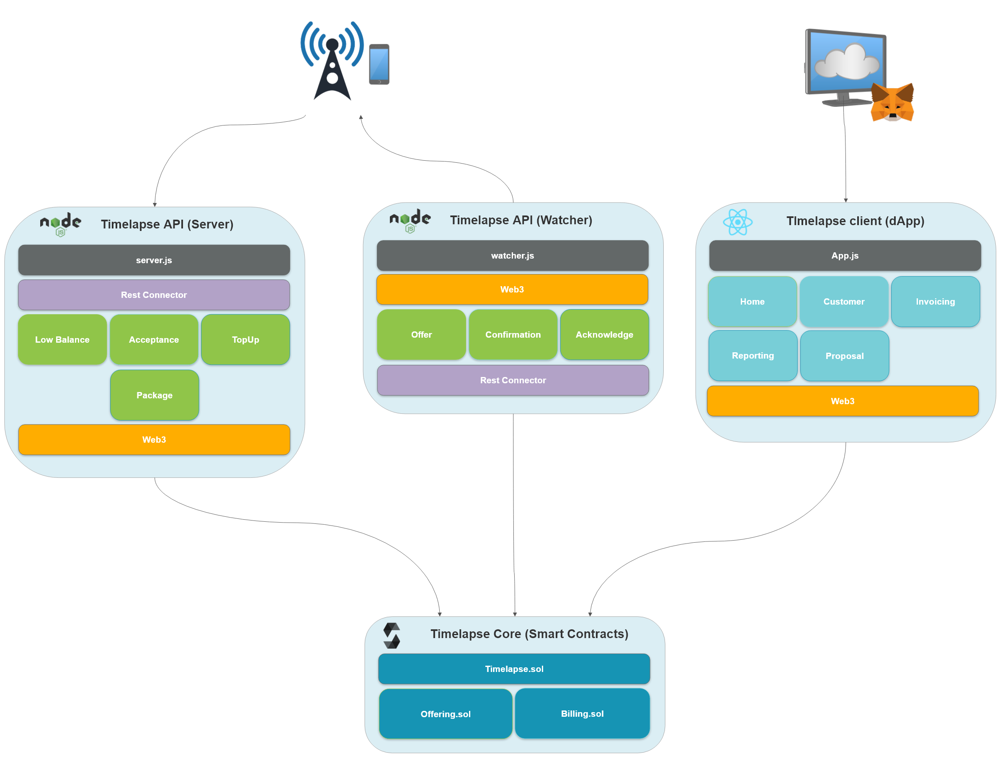

# Timelapse

> Timelapse is a solution that manages micro-credit offers for telecommunications operators.

## Features

- Proposals management
- Learn on customers based on network information
- Customer scoring
- Offering
- Billing

## Links

* Open Application: [https://timelapse-project.herokuapp.com/][heroku-url]
* [Documentation](#documentation)
* [Github](https://github.com/timelapse-project/timelapse) (this repository: code, issues, wiki)

## Architecture

Timelapse software is composed of 3 parts:
- **Timelapse Core**:  
The **Ethereum smart-contracts** deployed on the testnets. They are written in Solidity.
- **Timelapse Client** (DApp):  
A **ReactJS client app** written in ReactJS and deployed on Heroku. 
It  provides the User Interface to interact with the contracts.
- **Timelapse API**:  
The **Server/Watcher** written in NodeJS.

This Github **repository** gather the **back-end and**, the **front-end** and the **API** code.

### High Level Architecture


### Low Level Architecture


### Timelapse Core

Timelapse Core is composed of the following Ethereum **smart-contracts**:

- [`Timelapse`](contracts/Timelapse.sol) The entry point of Timelapse application.
- [`Offering`](contracts/Offering.sol) Manage all aspects related to offering. The contract is in charge of:
    - proposals management
    - customers management
    - products management
- [`Billing`](contracts/Billing.sol) Manage all aspects related to billing. The contract is in charge of:
    - customers management
    - accounting management
    - billing management

### Timelapse Client

Our **DApp** is a **Front-End** application written in **ReactJS** and deployed on Heroku.

### Timelapse API

Our **Timelapse API** application, written in **NodeJS**, is responsible for the communication with Telecom Operator and is composed of the following parts:

- [`server.js`](server/server.js) Manage incoming Rest calls from Telecom Operator and call blockchain.
- [`watcher.js`](server/watcher.js) Listen to blockchain and initiate Rest calls to Telecom Operator.

# Installation

- Install [`nodejs` and `npm`](https://docs.npmjs.com/downloading-and-installing-node-js-and-npm)
- Install [`git`](https://git-scm.com/)
- Clone the Github repository

  ```
  # Clone the repository
  git clone git@github.com:timelapse-project/timelapse.git
  cd timelapse
  ```

- Install the `npm` packages for timelapse-core, timelapse-client and timelapse-api

  ```
  # Update npm to its latest version
  sudo npm install -g npm

  # Install the npm packages for timelapse-core
  npm install

  # Install the npm packages for timelapse-client
  npm --prefix client/ install

  # Install the npm packages for timelapse-api
  npm --prefix api/ install
  ```

# Configuration

## Timelapse Private Blockchain Configuration
This project was developped on **Solidity** and can be used on any Ethereum-like Network. 
In the scope of the POC, private blockchain has been deployed and used.
Here is the connection configuration:
- Network Name: Timelapse
- RPC URL: http://timelapse.rocdasys.com:8545
- Network ID: 1000
- Symbol: ETH

## Environment Parameters

To deploy the project, you need to create a **`.env`** file in the project's root folder. You can use the **`.env.template`** file to determine which variables can be set.
To deploy the project on Timelapse Private Blockchain, you can set the following information:

    GETH_IPC_HOST="timelapse.rocdasys.com"
    GETH_IPC_PORT=8545
    GETH_IPC_ID="1000"
    GETH_IPC_URL="http://timelapse.rocdasys.com:8545"
    GETH_IPC_WS="ws://timelapse.rocdasys.com:8546"

## Heroku Configuration

Here is the procedure to install and configure Heroku:

- Download and install [Heroku CLI](https://devcenter.heroku.com/articles/heroku-cli#download-and-install).  
- Configure the Heroku **remote repository**
    ```
    # git clone git@github.com:timelapse-project/timelapse.git
    cd timelapse

    # Login (once) to Heroku via CLI if you have not already done
    heroku login

    # Option A: If not existing, create the heroku git remote repository
    heroku create --ssh-git --buildpack mars/create-react-app timelapse-project

    # Option B: If existing, declare the heroku git remote repository
    heroku git:remote --ssh-git -a timelapse-project
    ```
# Compile

## Timelapse Core

Here is the procedure to compile **Timelapse Core**:
- Compile contracts:
    ```
    export PATH=$PATH:node_modules/.bin
    truffle compile
    ```
# Test

## Timelapse Core

[This page](doc/tests_explication.md) explains the tests.
- Test contracts:
    ```
    export PATH=$PATH:node_modules/.bin
    truffle test
    ```

# Deploy

## Timelapse Core

Here is the procedure to deploy **Timelapse Core**:
- Deploy the contracts to Timelapse Private Blockchain:
    ```
    export PATH=$PATH:node_modules/.bin
    truffle deploy --network timelapse
    ```

***Remark***: This contracts deployment is not mandatory. In the file **[`deployed_addresses.md`](doc/deployed_addresses.md)**, you can always find the current ***Contracts Addresses*** that are published to the Timelapse Private Blockchain.

## Timelapse Client

There are 2 ways to deploy **Timelapse Client**:
- Local version: 
    ```
    npm --prefix client/ run start
    ```

    ***Remark***: If you meet a dependency issue, please remove the webpack module from the ***Timelapse Core*** node_modules and restart the previous command:
    ```
    rm -rf node_modules/webpack
    ```

- Heroku version
    ```
    git subtree push --prefix client/ heroku master
    ```

# Execution

## Timelapse Client

There are several way to execute **Timelapse Client**:
- Local version: 
    Access the [Local version](http://localhost:3000/)

- Heroku version
    Access the [Heroku version][heroku-url]

## Timelapse API

There are several way to execute **Timelapse Core**:
- Local version: 
    ```
    # git clone git@github.com:timelapse-project/timelapse.git
    cd timelapse/api

    # Execute the Server
    node server.js

    # Execute the Watcher
    node watcher.js

    # Execute the Telecom Operator Simulator
    ./simulator.sh
    ```

# Documentation

## General

- [avoiding_common_attacks.md](doc/avoiding_common_attacks.md) describes the measures we have taken to make our smart-contracts as resistant as possible to common attacks and potential hacks
- [deployed_addresses.md](doc/deployed_addresses.md) contains the addresses of smart-contracts deployed on the private network of `Timelapse`
- [design_pattern_decisions.md](doc/design_pattern_decisions.md) explains why we chose the design patterns we are using in the code. 
- [tests_explication.md](doc/tests_explication.md) explains for each test why we wrote it and  what it is aimed at.

## Smart-Contracts

The smart-contracts documentation is available in the folder [doc/contracts](doc/contracts):

- [Timelapse.sol](doc/contracts/Timelapse.md)
- [Offering.sol](doc/contracts/Offering.md)
- [Billing.sol](doc/contracts/Billing.md)

# Team

- Project Managers
  - Laurent Besse
  - Stefan Hudyka
- Devs
  - [@DavidRochus](https://github.com/DavidRochus)
  - [@Keymon](https://github.com/Keeymon)

# License

_[Timelapse][timelapse-url]_ is released under the terms of the MIT license.  
See COPYING for more information or https://opensource.org/licenses/MIT .

# Sources
Here are a few links to resources that we used while building bet-no-loss.
- Solidity
    - https://docs.soliditylang.org/en/v0.8.6
    - [@openzeppelin/contracts](https://docs.openzeppelin.com/contracts)
    - [Solidity Patterns](https://fravoll.github.io/solidity-patterns/)
- Security
    - [Security Hacks](https://solidity-by-example.org/)
- Private BlockcChain
    - [Geth](https://geth.ethereum.org/docs/)
- Test
    - [@openzeppelin/test-helpers](https://docs.openzeppelin.com/test-helpers/)
    - [Chai](https://www.chaijs.com/) TDD assertion library

<!-- Github Badges: Images and URLs -->

[timelapse-url]: https://github.com/timelapse-project/timelapse
[heroku-url]: https://timelapse-project.herokuapp.com/
[doc-url]: #documentation
[team-url]: #team
